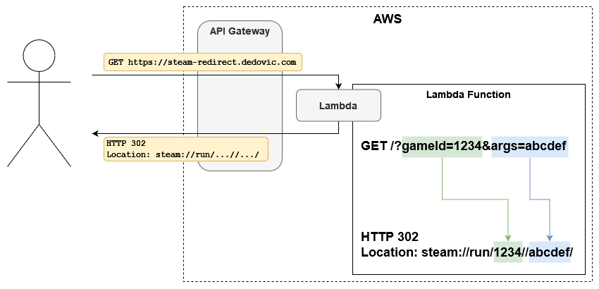

# Steam Redirect API
## What?
This project houses all the infrastructure and code required to spin up a simple HTTP redirect service. In the current configuration, I use it to redirect browsers to launch Steam games. Valve (and Steam) [supports a rich browser protocol](https://developer.valvesoftware.com/wiki/Steam_browser_protocol) which allows interating with Steam from the browser.

## Why?
Some applications, i.e. Discord, do not treat custom protocols as hyperlinks and in some cases reject webhooks that use custom protocols in URL content. This is frustrating, as I would like to have a bot that notifies a Discord channel when a custom / dedicated server is running, allowing users to bookmark or click inside of Discord to join. So instead, I must link to an HTTP service which simply redirects the brower to a Steam protocol link, e.g. `steam://run/1621690//`. In the example, it launches Core Keeper.

## How?
A simple Lambda Function that turns incoming HTTP requests into a redirect. Arguments in the query string are turned into path variables.

